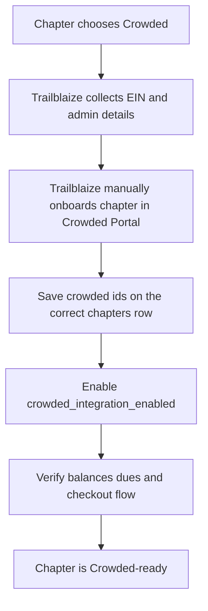

# Crowded Onboarding

## Purpose

This document defines the near-term Trailblaize process for onboarding future chapters and organizations that choose to use Crowded for dues and financial management.

This is an MVP onboarding guide. It reflects how the app works today and how we should operationalize future chapter setup until we build a more automated onboarding flow.

## Summary

For MVP, Trailblaize supports **manual Crowded onboarding**.

Each chapter or organization that chooses Crowded must:

- provide its own `EIN`
- be manually onboarded into Crowded
- be manually linked to the correct Trailblaize `chapters` row
- have Crowded features enabled only after setup is verified

At a high level, future chapters should follow the same onboarding and integration pattern used for the current demo chapter.

---

## Current MVP Model

Trailblaize currently supports a simple model:

- one Trailblaize `chapters` row
- one mapped Crowded chapter context
- optional Crowded organization id stored on the same chapter row
- a chapter-level feature flag to enable or disable Crowded usage

This means the app expects Crowded access to be resolved from chapter-level metadata already stored in Supabase.

Relevant current fields and behavior:

- `chapters.crowded_chapter_id`
- `chapters.crowded_organization_id`
- `feature_flags.crowded_integration_enabled`

Crowded-powered routes and UI should not be considered active until the chapter mapping is complete.

---

## Scope And Assumptions

This document assumes the following near-term business rules:

- every chapter or organization that uses Crowded will provide its own `EIN`
- Trailblaize will manually onboard that customer into Crowded
- Trailblaize will manually store the resulting Crowded identifiers on the correct chapter row
- MVP onboarding is operational and manual, not self-serve

This document does **not** assume:

- fully automated Crowded provisioning
- self-serve customer linking
- a required parent-org plus Sub Account model for all customers

---

## Supported MVP Outcome

After successful onboarding, a chapter should be able to use the currently supported Crowded MVP features:

- chapter-level Crowded account visibility
- treasurer-facing Crowded balance card
- Crowded collection creation and linking to dues cycles
- member dues checkout through Crowded
- webhook-driven dues and ledger updates

The onboarding goal is to make a chapter "Crowded-ready" in a repeatable and operationally safe way.

---

## Required Data From The Customer

Before manual onboarding begins, collect at least:

- legal organization or chapter name
- `EIN`
- primary chapter admin or treasurer name
- admin email
- admin phone number
- Trailblaize chapter name
- Trailblaize `chapters.id`
- confirmation that the chapter wants Crowded enabled for dues and financial workflows

Useful additional metadata:

- university name
- chapter type
- internal owner at Trailblaize for the onboarding

---

## Manual Onboarding Flow

### 1. Confirm the Trailblaize chapter exists

Before any Crowded work begins:

- confirm the correct row already exists in `public.chapters`
- confirm the chapter is the intended customer record
- confirm the Trailblaize `chapters.id` that will receive the Crowded mapping

### 2. Collect onboarding information

Collect the chapter's required details, especially:

- legal name
- `EIN`
- treasurer or admin contact details

This should happen before Crowded setup starts so onboarding can be completed in one pass.

### 3. Manually onboard the customer in Crowded

Trailblaize manually works through Crowded setup for the customer.

This may include:

- creating or completing the Crowded account
- finishing required onboarding or verification steps
- confirming the Crowded chapter or organization is fully provisioned
- confirming that accounts and collections can be used

### 4. Capture Crowded identifiers

After setup, capture the Crowded identifiers needed for the app:

- `crowded_chapter_id`
- `crowded_organization_id` when available or useful

These are the identifiers Trailblaize uses to route chapter-scoped Crowded API calls.

### 5. Store the mapping on the Trailblaize chapter row

Update the correct `public.chapters` row with:

- `crowded_chapter_id`
- `crowded_organization_id` if available

This is the core link between Trailblaize and Crowded for the chapter.

### 6. Enable Crowded for that chapter

Only after the mapping is valid:

- enable `crowded_integration_enabled`

Do not enable the feature flag before the chapter is actually linked to Crowded.

### 7. Run a post-onboarding verification

Before considering the onboarding complete, confirm the chapter can:

- load Crowded account data
- create or view collections
- link a dues cycle to Crowded
- generate a member checkout flow

If these checks fail, the chapter should remain in a setup or blocked state until the mapping or Crowded configuration is corrected.

---

## Trailblaize Data Mapping

For MVP, the source of truth for Crowded linkage is the `chapters` row.

Expected fields:

- `chapters.id` — the Trailblaize chapter id
- `chapters.crowded_chapter_id` — required for chapter-scoped Crowded API calls
- `chapters.crowded_organization_id` — optional but useful for future org-level behavior

Operational rule:

- if `crowded_chapter_id` is missing, the chapter is not Crowded-linked
- if `crowded_integration_enabled` is false, Crowded functionality should be treated as disabled even if ids exist

---

## Activation Rules

A chapter should be considered Crowded-active only when **all** of the following are true:

1. The customer has completed manual Crowded onboarding.
2. The correct Trailblaize `chapters` row has been identified.
3. `crowded_chapter_id` has been saved on that row.
4. `crowded_integration_enabled` has been turned on.
5. Basic post-onboarding verification has succeeded.

If any of these are false, the chapter should not be treated as fully live for Crowded-powered dues and financial workflows.

---

## Verification Checklist

Use this checklist after onboarding each chapter:

- chapter row exists in `public.chapters`
- correct `chapters.id` is documented
- `crowded_chapter_id` is present and correct
- `crowded_organization_id` is stored when available
- `crowded_integration_enabled` is on
- account balance route loads successfully
- chapter account list returns expected account rows
- a Crowded collection can be created or linked
- a dues cycle can be linked to `crowded_collection_id`
- member checkout flow can be generated

Optional but recommended:

- verify webhook setup and receipt
- verify post-payment updates in Trailblaize
- verify no unexpected `NO_CUSTOMER` or onboarding errors remain

---

## Failure States

Common onboarding failure modes:

- chapter exists in Trailblaize but has no `crowded_chapter_id`
- Crowded feature flag enabled before mapping is complete
- Crowded account setup is incomplete and accounts return `NO_CUSTOMER`
- ids are stored on the wrong chapter row
- chapter is linked in Crowded but post-onboarding verification was never completed

When these occur, the chapter should be treated as partially onboarded, not live.

---

## MVP Operating Rule

For the foreseeable MVP phase:

- every future chapter that opts into Crowded should be onboarded the same way as the current demo chapter
- onboarding remains manual
- the integration is considered complete only after the chapter mapping and verification steps are finished

This gives Trailblaize a repeatable process without requiring immediate architectural changes to the current Crowded implementation.

---

## Related Docs

- `docs/development/crowded/Accounts.md`
- `docs/development/features/crowded_cursor_postman_session.md`
- `docs/DATABASE_SCHEMA.md`

