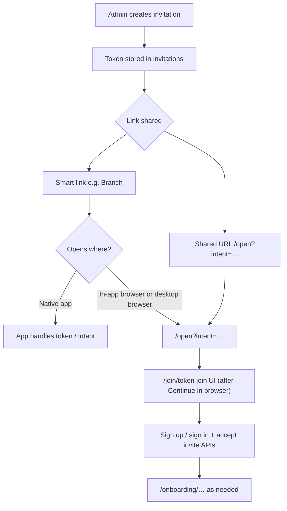

# Chapter invites, web join, and mobile (Branch) handoff

This document is a **high-level** overview of how chapter (and related) invitations work in the Trailblaize web app today, how that connects to **smart links / Branch-style** fallbacks, and what is **left to do** across web, mobile, and link configuration.

For the **exact query-parameter contract** the web resolver accepts, see inline documentation in `lib/utils/deferredAppRouting.ts` and the `/open` route described below.

---

## Goals

- Admins create **durable invite tokens** tied to a chapter (and optional rules: expiry, max uses, approval mode, type).
- Invitees open a link on **any device** and either use the **native app** (when installed), **install from a store**, or **continue in the browser** with the same Supabase-backed account and chapter logic.
- **One consistent semantic payload** (e.g. invite token) for web and app, whether the user arrives via a full `https` URL or a short smart link whose **browser fallback** hits the web app.

---

## End-to-end flow (conceptual)

**Important:** Device detection and “try app first” behavior for **short smart links** are owned by the **link provider + native app** (e.g. Branch). The web app’s job is to expose **safe, documented URLs** so fallbacks land on the right page with the right **query parameters or path segments**.

---

## What is implemented today (web + API)

### Invitations data model

- Invitations are stored in **`invitations`** with a unique **`token`**, **`chapter_id`**, **`created_by`**, lifecycle fields (`expires_at`, `max_uses`, `usage_count`, `is_active`), **`approval_mode`**, **`invitation_type`** (e.g. active vs alumni-oriented flows), and optional **`email_domain_allowlist`**.
- Usage is tracked via **`invitation_usage`** (and related product flows such as pending chapter approval where applicable).
- TypeScript shapes live in `types/invitations.ts`.

Server-side validation for public flows uses **`validateInvitationToken()`** in `lib/utils/invitationUtils.ts` (checks active row, expiry, usage limits, loads chapter name for display).

### Canonical shared URLs (no Branch required)

- **`lib/utils/openBridgeUrls.ts`** builds absolute **`/open`** entry URLs with the same query contract as `deferredAppRouting.ts`.
- **`generateInvitationUrl()`** / **`generateChapterJoinUrl()`** (`lib/utils/invitationUtils.ts`) delegate to those helpers:
  - Active member: **`{origin}/open?intent=invite&token=…`** → continue → **`/join/{token}`**.
  - Alumni type: **`{origin}/open?intent=alumni_invite&token=…`** → **`/alumni-join/{token}`**.
  - Chapter slug: **`{origin}/open?intent=chapter_join&slug=…`** → **`/join/chapter/{slug}`**.

Admins copy these from invite management UI; APIs such as **`POST /api/invitations`** return `invitation_url` in this **bridge-first** shape. Join pages and validation are unchanged; only the **first** URL users receive is `/open`.

### Event emails (magic link → bridge → event)

- **New event** and **event reminder** emails (`EmailService.sendEventNotification`, `sendEventReminder`) use Supabase magic links whose **`redirectTo`** targets **`/open?intent=web&path=%2Fevent%2F…`** (built via **`buildOpenBridgeWebIntentRelativeLink`**), then **Continue in browser** resolves to the public **`/event/…`** page.

**Supabase dashboard:** allow redirect URLs that include **`/open`** with query strings for the deployed host(s), e.g. `https://www.trailblaize.net/open**` (see Supabase redirect URL documentation).

### Join and accept flows

- **`/join/[token]`** — client-driven join experience; server metadata (e.g. Open Graph) uses validated invitation + chapter name when possible (`app/join/[token]/page.tsx`).
- **`/join/chapter/[slug]`** — join by chapter slug (`app/join/chapter/...`).
- **`/alumni-join/[token]`** — alumni-oriented join surface.
- **Accept / validate APIs** include, for example:
  - **`GET /api/invitations/validate/[token]`** — returns safe invitation summary for a valid token.
  - **`POST /api/invitations/accept/[token]`** — signup / attach user to invitation flow (see `app/api/invitations/accept/[token]/route.ts`).

### Smart-link **browser fallback** page: `/open`

When a smart link opens in a **normal browser** (app not opened), the product needs a small **bridge** page. This repo implements **`GET /open`** in the marketing area:

- **Server:** `app/(marketing)/open/page.tsx` reads `searchParams`, resolves a **continue path** via **`resolveOpenBridgeContinuePath()`** (`lib/utils/deferredAppRouting.ts`), optionally resolves **chapter name** for **`intent=invite`** using **`validateInvitationToken()`** (only when valid — invalid tokens do not leak chapter names on this page).
- **Client:** `app/(marketing)/open/OpenBridgeClient.tsx` — logo, trust copy when chapter name is known, **primary CTA: continue in browser** (navigates to resolved path), **secondary: App Store / Google Play** when `NEXT_PUBLIC_APP_STORE_URL` / `NEXT_PUBLIC_GOOGLE_PLAY_URL` are set (see `.env.example`).

### Supported bridge intents (web resolver)

`resolveOpenBridgeContinuePath()` maps query params to **same-origin** paths, for example:

| Intent | Typical params | Resolved web path |
|--------|----------------|-------------------|
| Chapter invite | `intent=invite&token=…` | `/join/{token}` |
| Alumni invite | `intent=alumni_invite&token=…` | `/alumni-join/{token}` |
| Chapter slug | `intent=chapter_join&slug=…` | `/join/chapter/{slug}` |
| Generic web | `intent=web&path=…` (+ optional validated `search`) | Allowlisted path only (guards against open redirects) |

Allowlisted prefixes for `intent=web` include `/join/`, `/dashboard`, `/onboarding`, `/sign-in`, `/sign-up`, `/profile`, `/event/`, `/alumni-join/`, etc. **Update the allowlist in code** when adding new public entry points.

### Onboarding after join

- Post-signup onboarding lives under **`app/onboarding/…`** (steps, pending approval, completion).
- Bridge **`intent=web`** can target `/onboarding/…` when product wants “continue on web” to skip straight to onboarding (path must remain allowlisted).

---

## Branch.io (or similar) — how it fits

The web implementation is **provider-agnostic**: Branch is optional. If you use Branch:

1. **Fallback URL** (desktop / in-app browser / no app): should point at this app’s **`/open`** (or a subdomain that **301/302**s to the same path) with the **same query string** you would use for a direct link, e.g.  
   `https://www.trailblaize.net/open?intent=invite&token={TOKEN}`  
   Use the **correct origin** per environment (production vs staging) so Supabase validation matches the deployment.
2. **Link data / deep link payload:** mirror the **`intent` + `token` / `slug` / `path`** contract so the native app and web agree on semantics.
3. **Native app:** on successful open, handle the payload in the SDK; **do not** require hitting `/open` when the app already opened.
4. **Allowlists:** if the provider restricts redirect domains, include all web hosts you use.

**Note:** Admin **`invitation_url`** values are **`/open?...`** entry URLs. A **Branch** (or other) short link can still wrap the same URL as its web fallback; no extra DB column is required if the Branch template mirrors `intent` + `token` / `slug`.

---

## Remaining work (recommended backlog)

### Link provider and mobile

- [ ] Configure **Branch** (or chosen provider): template links per intent, **fallback** → `/open?...`, iOS/Android URI schemes / universal links aligned with app.
- [ ] **Native app:** parse same **`intent` + fields** as web; route to invite join screen; support **deferred deep link** after install if offered by the provider.
- [ ] Decide **canonical link for admins**: direct `https://…/join/…` vs always Branch; if Branch, add **server or dashboard** generation and optionally telemetry.

### Web product / UX

- [ ] **CTA order:** current `/open` emphasizes **browser first**; many invite flows want **“Open in app”** first on mobile (may be a **link** to the universal/smart URL, not only store buttons). Align copy and layout with product spec.
- [ ] **Inviter line** (“Parker invited you…”): data exists via **`created_by`**; `/open` and/or **`GET /api/invitations/validate/[token]`** could expose a **minimal public display name** only for valid tokens (privacy review).
- [ ] **Optional subdomain** (`invite.…`): only needed for branding or static hosting; functionally equivalent if it routes to the same Next.js **`/open`** and query params.

### Web engineering / docs

- [ ] Keep **`deferredAppRouting`** and any marketing copy in sync when adding intents or allowlisted paths.
- [ ] Align **`docs/DATABASE_SCHEMA.md`** `invitations` section with **`types/invitations.ts`** and migrations so engineers do not rely on an outdated column list.

### Auth parity (cross-cutting)

- [ ] Audit **Apple / Google / phone OTP** on web for **join** and **onboarding** paths if the goal is full parity with mobile (see existing auth hardening / Apple sign-in docs under `docs/users/`).

---

## Quick code index

| Area | Location |
|------|-----------|
| Invite token validation | `lib/utils/invitationUtils.ts` |
| Open bridge URL builders | `lib/utils/openBridgeUrls.ts` |
| Public URL helpers | `lib/utils/invitationUtils.ts` (`generateInvitationUrl`, `generateChapterJoinUrl`) |
| `/open` resolver + allowlist | `lib/utils/deferredAppRouting.ts` |
| `/open` server page | `app/(marketing)/open/page.tsx` |
| `/open` UI | `app/(marketing)/open/OpenBridgeClient.tsx` |
| Create/list invitations API | `app/api/invitations/` |
| Validate token API | `app/api/invitations/validate/[token]/route.ts` |
| Join pages | `app/join/`, `app/join/chapter/` |
| Onboarding | `app/onboarding/` |

---

## Summary

The **database and server validation** for invitations, the **web join surfaces**, and a **first-class browser fallback bridge** at **`/open`** are already in place, with a deliberate **query-parameter contract** for smart links. **Remaining work** is mostly **Branch (or equivalent) configuration**, **native deep linking**, optional **UX and inviter metadata** on the bridge page, and **operational decisions** about which URL admins share versus which URL providers use as fallback.
